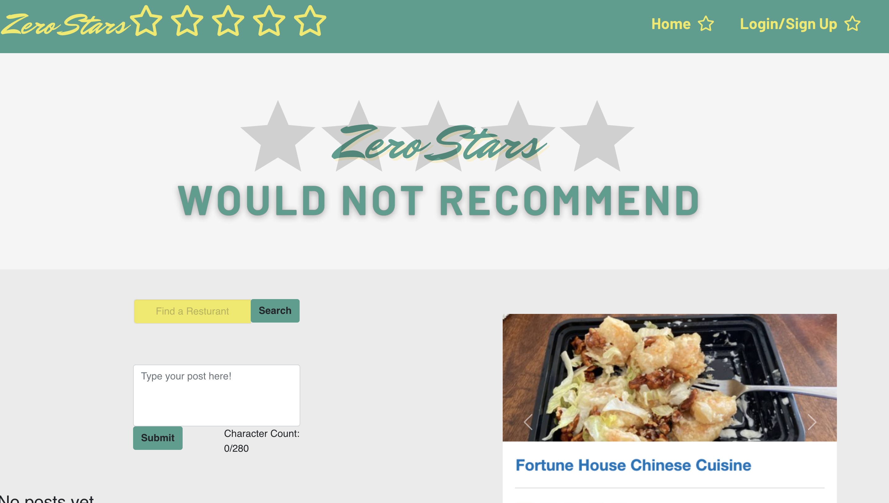

# Zero-Stars ☆☆☆☆☆
>
> This is a group project created by Ava, Tess, Janell, and Luisianna. 
>
> This project is deployed at: https://zero-stars-8.herokuapp.com/
>
>

# User Story
``` 
USER WILL BE ALLOWED TO SEARCH A RESTAURANT, 
THE USER IS GIVEN THE OPTION TO SIGN UP, 
THEN WHEN CREATING AN ACCOUNT THE USER ALSO CREATES A PROFILE, 
HAVING AN ACCOUNT ALLOWS THE USER TO CREATE POSTS 
THEN THE USER CAN LOGIN AND LOG OUT AS THEY WISH

```




## License 
[](https://opensource.org/licenses/MIT)
https://choosealicense.com/licenses/mit/

# React App

This project was bootstrapped with [Create React App](https://github.com/facebook/create-react-app).


